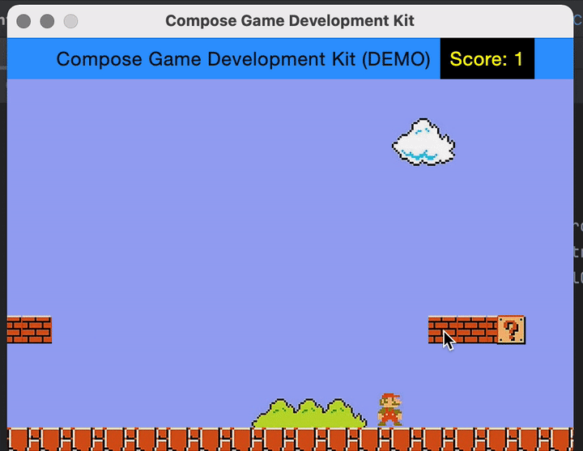

# ComposeGDK
The goal of Compose Game Development Kit, is to provide a Multiplatform Game SDK based on Compose. It is a 2D Game Engine ideal to build old-school games like Platform, Puzzle or Fight Games.

## Disclaimer
This is **not** a game, this is a development kit to build games.

This is not a Google or JetBrains project, this is not supported by any company (yet). Given the experimental nature of this project, I can't guarantee much support at this stage. I hope we can build a community so that this become a strong library.


## Install
Compose GDK requires Java 11 or above. It can be installed with homebrew (MacOS)
```
$ brew install java11
$ sudo ln -sfn /usr/local/opt/openjdk@11/libexec/openjdk.jdk /Library/Java/JavaVirtualMachines/openjdk-11.jdk
```
Verify the version is correct
```
$ /usr/libexec/java_home
$ java -version
```

then run for MacOS 💻:
```
$ ./gradlew run
```

then run for Android 🤖:

```
$ ./gradlew installDebug
```

## Roadmap 🗺
- [ 20%] Scroll and parallax
- [ 20%] Basic character/object movement (forward, backward, jump)
- [ 30%] Collision support
- [ 40%] Keyboard support
- [ 10%] Score system
- [ 10%] Touch Controller support (Touch screen joystick)
- [  0%] Introducing more example of game
- [  0%] Gravity / Physical support
- [  0%] Performance and optimisations
- [  0%] Sound support
- [  0%] Animated image (GIF-like)
- [  0%] Play/pause
- [  0%] Save mechanism
- [  0%] Multi-player (2 people with 1 keyboard, MacOS only)
- [  0%] Game Controller support (XBox, PS4+)
- [  0%] Local Multi-player (with multiple Game Controller)
- [  0%] Network
- [  0%] Multi-player over Network
- [  0%] Mouse support
- [  0%] Accelerometer support


# Main principles
## CGDKObject (GameObject)
the simplest object is CGDKObject, it has position and size, this can be extended to place more complex object on the screen, such as ImageCGDKObject.

## GameCanvas
The GameObjects are placed on the Game Canvas

## Animation / Scroll
Both Horizontal and Vertical scroll have been implemented, they support speed which can be use to create a parallax effect

## Collision detector
The collision detector is very simple at this stage, it help to determine if 2 objects has entered in collision, this is useful to prevent object going too far, determine if the hero has encourter an ennemie or to implement gravity.

## Controllers
- A Simple Keyboard controller that have 4 directions is implemented
- A Draft of Touch and Joystick Virtual Controller (for touch screen) is implemented

## Score
A basic score controller has been implemented: `ScoreManager`

## Image / Resource Loader
Image loader leverage `expected` and `actual` to load images from different location depending on the platform. Currently, it loads the images as follows:
### Compose Desktop
Images are loaded from the `resources` folder `./common/src/commonMain/resources/`

### Android
Images are loaded from the `assets` folder `./android/src/main/assets/` by using a symbolic link to prevent having to duplicate the assets.


### Target state
Ideally the images should be place in a single folder accessible from both Desktop and Android.

# Known Issues
Any help on the following will be appreciated:
 * unable to build the library with `./gradlew build`, it's showing `Execution failed for task ':common:compileKotlinMetadata'` because the `openrndr-math` doesn't seem to resolve (but works when running, on both Android and MacOS)

# How can I help?
 * Check the know issue list and tackle one if you feel like
 * Create a simple game and provide feedback on your experience.
   * RPG Game: Zelda-like
   * Fight Game: Street fighter-like
   * Puzzle Game: Candy crush-like
   * Platform Game: Mario-like

# Examples
## Platform Game mario-like
